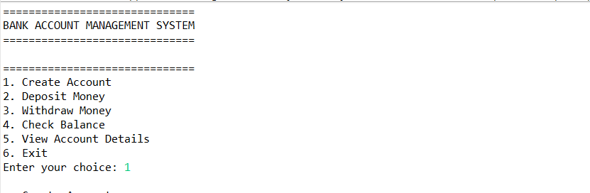
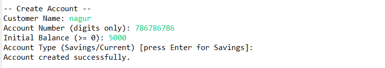
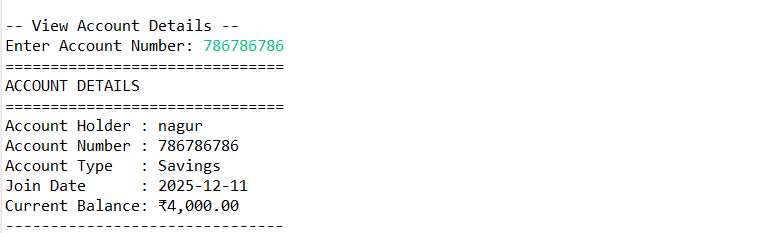

# Cognetix Bank Account Management System  
A modular **Java console application** built for the Cognetix Technology Java Developer Internship.  
This project demonstrates account creation, deposit/withdraw operations, balance checks, and account detail display — all managed through a clean menu-driven interface with proper validations.

---

## 🚀 Project Overview  
This application allows users to:

- Create new bank accounts  
- Deposit money  
- Withdraw money  
- Check account balance  
- View complete account details  
- Manage multiple bank accounts using `ArrayList<BankAccount>`

The project follows **OOP principles**, clean separation of classes, and modern Java coding standards (`LocalDate`, formatted output, input validation loops).

---

## 🧩 Features

### ✔ **Account Creation**
- Customer Name  
- Unique Account Number  
- Initial Balance (≥ 0)  
- Account Type (Savings / Current)  
- Auto-generated Join Date  

### ✔ **Deposit Money**
- Amount must be > 0  
- Updates balance  
- Confirmation message with new balance  

### ✔ **Withdraw Money**
- Amount must be > 0  
- Checks for sufficient balance  
- Clear error messages  

### ✔ **Check Balance**
Displays:
- Account Number  
- Holder Name  
- Current Balance (₹ format)

### ✔ **View Account Details**
Shows:
- Name  
- Account Number  
- Account Type  
- Join Date  
- Current Balance  

### ✔ **Supports Multiple Accounts**
Uses Java's `ArrayList<BankAccount>` to store unlimited accounts.

## 📁 Project Structure
src/
│
├── com.bank_account/
│ ├── Main.java → Console Menu + Input Handling
│ ├── BankAccount.java → POJO Class for Account
│ └── BankManager.java → Business Logic (create, find, deposit, withdraw)
│
├── docs/
│ └── screenshots/ → screenshots

---

## 🛠 Technologies Used
- **Java 11+**
- **LocalDate API**
- **OOP principles**
- **ArrayList Collection**
- **Scanner (for input handling)**

---

## 📌 Validations Implemented

| Field | Rules |
|-------|-------|
| Account Number | Digits only (no letters) |
| Initial Balance | Must be ≥ 0 |
| Deposit | Must be > 0 |
| Withdrawal | Must be > 0 and ≤ balance |
| Menu Input | Must be valid option |
| Name | Must not be empty |

All invalid inputs show clear error messages and re-prompt user.

---

## ▶ How to Run the Project

### **Running in Eclipse**
1. File → New → Java Project  
2. Create package: `com.bank_account`  
3. Add the files:  
   - `BankAccount.java`  
   - `BankManager.java`  
   - `Main.java`  
4. Right-click `Main.java` → **Run As → Java Application**

---
## 🖼 Screenshots

## 👨‍💻 Author

* Your Name : Nagur vali
* Java Developer Intern — Cognetix Technology

